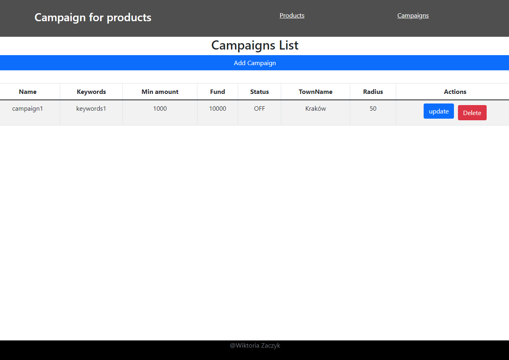

# Campaign for each of my products project

This project have full stack development (CRUD):

- rest API using Java Spring framework;
- using an H2 base booted in memory;
- simple frontend in JS framework React.js with Bootstrap

Looks:

